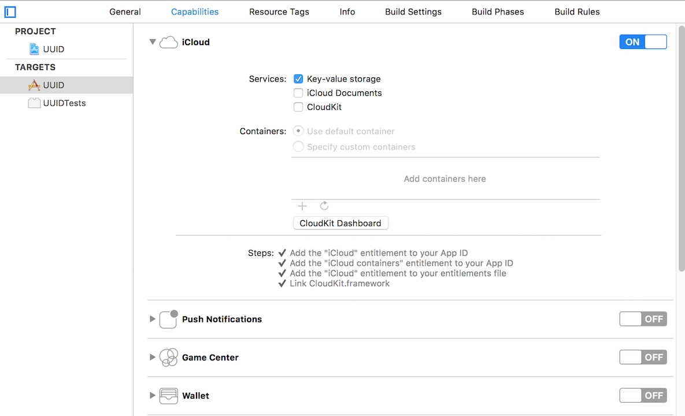

# UUID

## 对工程做如下配置：
- Key-value storage enabled *(target / Capabilities / iCloud / Key-value storage)*



## Usage
一句话获得`UUID`：
```objc
 [FCUUID uuidForDevice]

## 感谢 & 更多
FCUUID: <https://github.com/fabiocaccamo/FCUUID>
